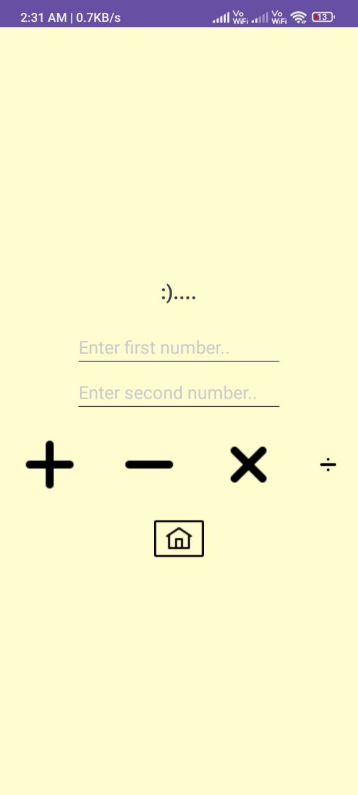
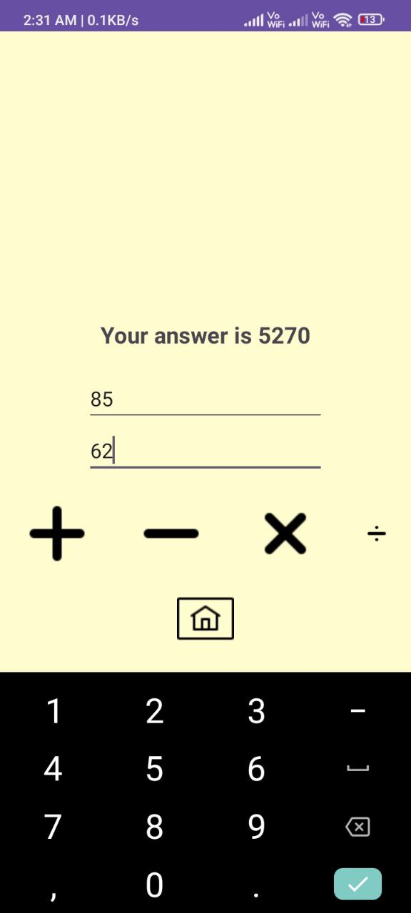
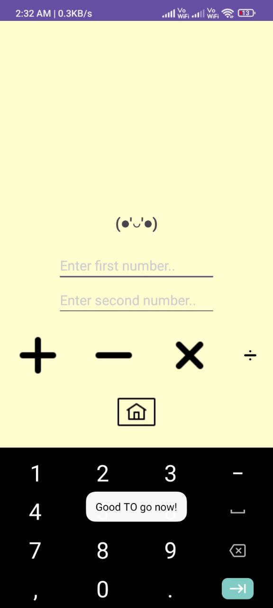

# MiniCalci


MiniCalci is a simple yet elegant calculator application built using Kotlin. It allows you to perform basic arithmetic operations with a user-friendly interface.

## Features

- Addition, Subtraction, Multiplication, and Division
- Intuitive and minimalistic design
- Easy-to-use number input
- Real-time calculation updates

## Screenshots

### Home Screen & Calculator Screen

|----|----|

|||

## Installation

To get a local copy up and running, follow these simple steps:

1. **Clone the repository**

```sh
git clone https://github.com/yuvrajsinghgmx/MiniCalci.git
```

2. **Open the project in Android Studio**

3. **Build and run the app**

## Usage

1. Enter the first number in the provided field.
2. Enter the second number in the next field.
3. Choose the operation you want to perform (Addition, Subtraction, Multiplication, Division) by tapping the respective button.
4. The result will be displayed instantly.

## Contributing

Contributions are what make the open-source community such an amazing place to learn, inspire, and create. Any contributions you make are **greatly appreciated**.

1. Fork the Project
2. Create your Feature Branch (`git checkout -b feature/AmazingFeature`)
3. Commit your Changes (`git commit -m 'Add some AmazingFeature'`)
4. Push to the Branch (`git push origin feature/AmazingFeature`)
5. Open a Pull Request

## More Screenshots

|---|---|
|||
